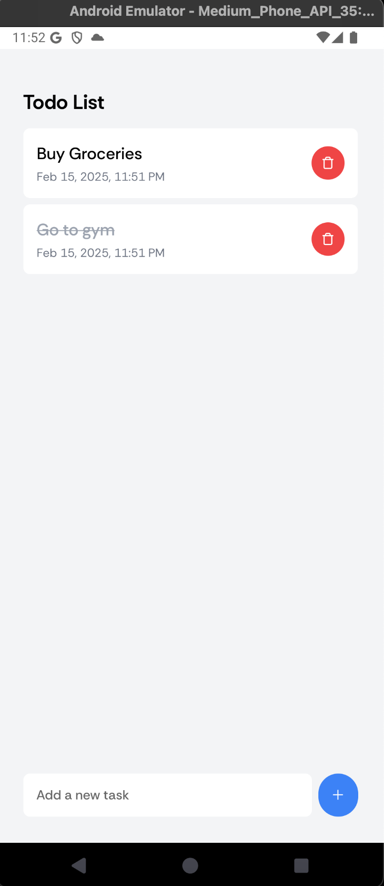

# Simple To-Do App

## Overview
This is a simple To-Do app built using React Native with Expo and styled using NativeWind. The app allows users to add, complete, delete, and reorder tasks with drag-and-drop functionality. Tasks persist even after app restarts using AsyncStorage.

## Features
- Add tasks via an input field.
- Display a list of tasks.
- Mark tasks as completed/uncompleted.
- Delete tasks.
- Drag and drop to reorder tasks.
- Smooth animations for adding/deleting tasks using React Native Animated API/Reanimated.
- Persistent storage with AsyncStorage.

## Tech Stack
- React Native (Expo)
- NativeWind for styling
- AsyncStorage for persistent data storage
- React Native Reanimated for animations
- React Native Gesture Handler for drag-and-drop

## Folder Structure
```
.
├── README.md
├── app
│   ├── _layout.tsx
│   ├── global.css
│   └── index.tsx
├── app.json
├── assets
│   ├── fonts
│   ├── images
├── components
│   ├── DraggableItem.tsx
│   └── Home.tsx
├── utils
│   └── helpers.ts
├── tailwind.config.js
├── tsconfig.json
├── package.json
└── metro.config.js
```

## Setup Instructions
### Prerequisites
Ensure you have the following installed:
- Node.js (>= 16.x)
- Expo CLI (`npm install -g expo-cli`)
- Yarn or npm

### Installation
1. Clone the repository:
   ```sh
   git clone https://github.com/Ayushhgupta39/expo-todo-app.git
   cd expo-todo-app
   ```
2. Install dependencies:
   ```sh
   npm install
   ```
   or
   ```sh
   yarn install
   ```

### Running the App
To start the app, run:
```sh
npx expo start
```
This will open the Expo Developer Tools, allowing you to run the app on an emulator or a physical device.

## Screenshot


## Additional Notes
- This app is an assignment by Ayush Gupta for the Frontend Intern position at The Milaan.

